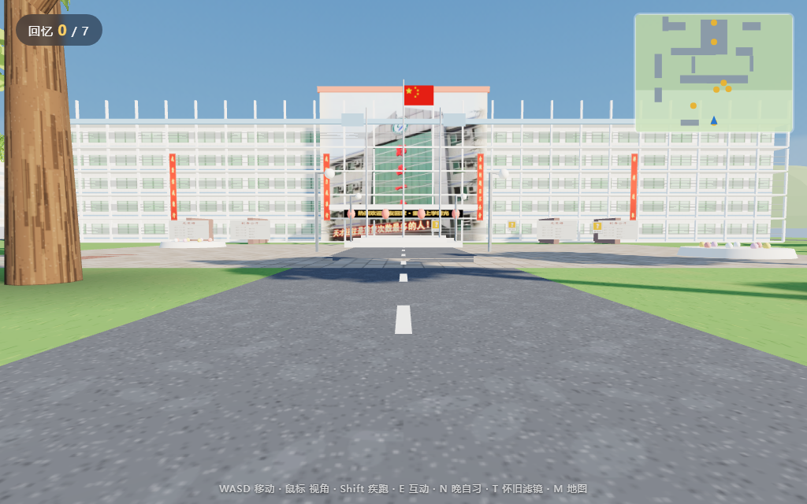
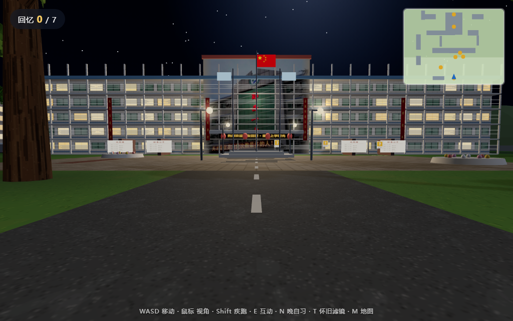

# 郧西一中 · 重温上学时光

一个可以"走进去"的 3D 校园探险小游戏。以湖北省十堰市**郧西县第一中学**（城关镇学苑路，
1941 年建校，校训"养正观成、立德树人"）为原型，根据校园实拍照片用 Three.js 低多边形重建，
在校园里拾起 7 段上学时代的回忆。

| 白天 | 晚自习（按 N） |
|------|------|
|  |  |

## 分享给同学

直接把 **`dist/郧西一中-重温上学时光.html`** 这一个文件发过去（微信/QQ 均可，约 2.3MB），
对方用 Chrome / Edge 双击打开即可完整体验——Three.js、代码和照片全部内嵌在这个文件里，无需联网。

重新打包：`python tools/build-single.py`（会把 `assets/reference/` 里最新照片一并嵌入）。

> 注意：需要电脑浏览器（键鼠操作），手机暂不支持；非商用性质的纪念分享没问题，
> 若要公开发布到 B 站/朋友圈等平台，建议先用自己拍摄的照片替换 `assets/reference/` 里两张网图。

## 怎么运行（完整文件夹版）

**方式一（最简单）**：双击 `index.html`，用 Chrome / Edge 打开即可。

**方式二（推荐）**：本目录下起个静态服务器（画面和加载更稳定）：

```bash
cd yunxi-campus-3d
python -m http.server 8000
# 浏览器打开 http://localhost:8000
```

## 玩法

| 按键 | 功能 |
|------|------|
| `W A S D` / 方向键 | 移动 |
| 鼠标 | 转视角（点击画面锁定指针） |
| `Shift` | 疾跑 |
| `E` | 拾起 / 翻看回忆 |
| `N` | 切换 白天 ⇄ 晚自习（教学楼的灯会一盏盏亮起来） |
| `T` | 怀旧褐色滤镜 |
| `M` | 开关右上角小地图 |
| `Esc` | 暂停 |

目标：找到散落在校园里的 **7 段回忆**（校门口、旗杆、宣传栏、大树下、红色拱门、
篮球场、教学楼前），集齐后触发结局。

## 场景对应（照片 → 游戏）

布局依据 `DESIGN.md`（基于 `E:\download\pic\一中\` 素材库 + 校友确认）：

- **主教学楼群**：中央绿玻璃塔楼（校徽+红色"郧西一中"+LED+灯笼，贴真实照片）+ 左右两翼教学楼（红色斜撑构架，照片06）+ 绿色圆筒楼梯塔（"图书馆"）
- **牌坊式校门**（校友确认）：砖柱 + 刻校名横梁 + 瓦檐 + 伸缩门 + 门卫室
- **老校没有跑道**（跑道是2018年后新盖的）——运动区为广场西侧水泥篮球场×2（照片06）
- **小花园**（04号老照片）：棕榈、修剪灌木、蜂窝砖停车区、红砖小径
- 广场花纹铺装、中央大树、宣传栏（第三块贴真实航拍）、旗杆国旗、校训石、车棚
- 学生公寓×2、食堂、实验楼（东北）、背后群山松林与信号塔

## 把老照片放进游戏（重要！）

打开 `assets/memories/README.md` —— 按文件名（`01.jpg` … `07.jpg`）把你的老照片放进
`assets/memories/`，回忆卡片就会自动显示它们，**不用改任何代码**。
2015 年以前的翻拍老照片效果最好。

## 参照素材来源

- `assets/reference/campus-aerial.jpg`：校园航拍（抖音号 15637078 视频截图，用户提供）
- `assets/reference/teaching-building-facade.jpg`：教学楼正面（百度百科词条配图）
- 学校信息：[百度百科 · 郧西县第一中学](https://baike.baidu.com/item/%E9%83%A7%E8%A5%BF%E5%8E%BF%E7%AC%AC%E4%B8%80%E4%B8%AD%E5%AD%A6/62337601)
- 老照片线索：[郧西一中校史文物资料征集倡议（搜狐，2018）](https://www.sohu.com/a/277202004_750318)

## 技术说明

- 纯 Three.js（r147，已本地化到 `lib/`），零依赖、零构建、可离线
- 写实化渲染：ACES 电影级色调映射、黄金时刻光照、天空穹顶 + IBL 环境光反射（PMREM）、
  面片树叶、接触阴影 / 楼底 AO、草叶与裂纹漫反射贴图
- 主楼正立面与宣传栏直接使用**真实照片**作为贴图（`assets/reference/`）；
  出于浏览器安全策略，`file://` 双击打开时自动回退为程序化贴面，用
  `python -m http.server` 等方式访问则显示照片版
- 音效（上下课铃、脚步声）由 WebAudio 实时合成
- 目录：`index.html` + `css/` + `js/`（textures / world / buildings / memories / controls / audio / main）

## 之后可以做什么

1. 用无人机重拍校园各角度照片，逐栋替换成更精细的模型/贴图
2. 录制同学的语音留言，放到对应回忆点（`audio.js` 里加一个播放器即可）
3. 加入"教室内部"可进入楼层（黑板、课桌、倒计时牌）
4. 老视频素材（2015 年前）可截帧后按 `assets/memories/` 的规则加入卡片，
   或在卡片里嵌 `<video>`
