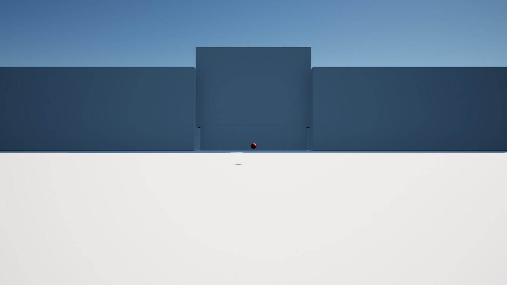

# UE 冒烟测试记录

工程：`unreal/YunxiCampus/YunxiCampus.uproject`，UE 5.8.2（安装路径 `E:\UE\UE_5.8`）。
本文档按任务推进持续追加。

## 1. 低画质渲染验证（2026-09-07）

### 渲染 CVar 实测值

编辑器启动日志（`Saved/Logs/YunxiCampus.log`，`LogConfig: Set CVar` 记录）与 Output Log 控制台查询结果：

| CVar | 实测值 | 预期 |
|---|---|---|
| r.DynamicGlobalIlluminationMethod | 0 | 0（Lumen 关闭） |
| r.ReflectionMethod | 0 | 0（反射方法 None） |
| r.Nanite.ProjectEnabled | 0 | 0（Nanite 关闭） |
| r.Shadow.Virtual.Enable | 0 | 0（Virtual Shadow Maps 关闭） |
| r.DefaultFeature.MotionBlur | 0 | 0（Motion Blur 关闭） |

同时生效的低画质键：`r.GenerateMeshDistanceFields=0`、`r.DefaultFeature.Bloom=False`、`r.Shadow.MaxResolution=1024`、`r.ReflectionCaptureResolution=128`；并显式覆盖模板 Maximum 预设写入的高画质项：`r.RayTracing=False`、`r.Substrate=False`、`r.SkinCache.CompileShaders=False`。

### Project Settings 交叉检查

启动日志的 `LogConfig: Set CVar` 记录即 Project Settings 最终生效值，与 `Config/DefaultEngine.ini` 一致，等效于 Rendering 设置页的目视核对。

### DDC 路径验证

- 用户级环境变量 `UE-LocalDataCachePath=E:\UE-DDC` 已设置。
- 启动日志确认：`LogZenServiceInstance: Found environment variable UE-LocalDataCachePath=E:\UE-DDC`、`Found local data cache path=E:\UE-DDC`，Zen 数据写入 `E:\UE-DDC\Zen`，C 盘不再承载项目缓存。

### First Person 模板移动验证（任务 3 步骤 2）

- Project Browser 创建工程（Games / First Person / 变体=无 / 蓝图 / Desktop），编辑器正常打开 `Lvl_FirstPerson`（63 Actor）。
- PIE 启动后执行 WASD、鼠标观察、Space 跳跃；PIE 完整运行并正常退出，日志无崩溃。
- Blueprint Runtime Error 计数：0。

### 已知偏差与备注

- Project Browser 的"质量预设"下拉框无法通过自动化展开，工程以 Maximum 预设创建；已通过合并脚手架低画质 RendererSettings 并显式关闭 RayTracing/Substrate/SkinCache 补偿，最终生效值见上表，等效达成 Scalable 目标。
- 编辑器每次启动提示 VC++ 可再发行组件 14.44.35211.0 过旧（非阻断警告）；后续打包如遇问题优先更新 VC++ 运行库。
- 验证机为真实桌面环境，编辑器运行于独立虚拟桌面以避免焦点竞争。

## 2. L_CampusTest 启动验证（任务 7，2026-09-07）

使用 `tools/ue/setup_campus_test_map.py` 保存目标地图后，运行：

```powershell
& 'E:\UE\UE_5.8\Engine\Binaries\Win64\UnrealEditor-Cmd.exe' `
  'unreal\YunxiCampus\YunxiCampus.uproject' -game -NullRHI -Unattended -NoP4 `
  -stdout -FullStdOutLogOutput '-ExecCmds=Quit'
```

结果：退出码 0；日志确认 `LoadMap(/Game/Campus/Maps/L_CampusTest)`、
`SM_MainBuilding` 就绪、世界进入 Play 并正常退出。地图包含
`MainBuilding`、`CampusGround`、`CampusPlayerStart`、`CampusSun` 和
`CampusSkyLight` 五个 Actor。GUI PIE/Standalone 的人工行走路线尚未记录，安排在任务 11。

## 3. 主楼低成本材质验证（任务 8，2026-09-07）

使用 `tools/ue/rebuild_main_materials.py` 生成并保存：

- `M_Campus_Master`：Opaque、Default Lit，参数为 BaseColor、Roughness、Metallic、NormalStrength。
- `M_Campus_Glass`：Translucent、Default Lit、单面，绿色 BaseColor、Opacity 0.55、Roughness 0.25。
- 8 个材质实例：`MI_Main_WhiteTile`、`MI_Main_BlueBand`、`MI_Main_GreenGlass`、`MI_Main_Concrete`、`MI_Main_RedStructure`、`MI_Main_Aluminium`、`MI_Main_DarkInterior`、`MI_Main_RedPaving`。

命令行日志确认 `CAMPUS_MAT MATERIALS_OK slots=10`。10 个导入槽已按 Blender 名称分配：蓝带、混凝土、白色 Trim、红结构、绿色玻璃、玻璃阴影、白砖、砖阴影、红铺装和红字。材质图只使用基础颜色、粗糙度、金属度和透明度参数，未启用折射或高成本透明阴影。

## 4. 回忆点资产基线（任务 9，2026-09-07）

使用 `tools/ue/create_memory_interaction.py` 完成：

- 照片 `E:\download\pic\一中\06_广场课间操全景_布局关键图.jpg` 已导入为 `/Game/Campus/Textures/Memories/T_Memory_01`，尺寸 853×640，纹理分组按 UI 兼容属性尝试设置，最大尺寸上限为 2048。
- 创建 `/Game/Campus/Blueprints/BPI_Interactable`、`BP_MemoryPoint` 和 `/Game/Campus/UI/WBP_MemoryViewer`。
- `L_CampusTest` 已放置 `MemoryPoint_01`（位置 0, -2500, 140）和可见的 `MemoryPointMarker` 球体标记，标记使用红色结构材质。

UE5.8 命令行 Python 将 `EdGraphPinType` 暴露为不可写的 opaque struct，无法可靠地自动写入 Blueprint 变量和图节点；因此 `BP_MemoryPoint` 的 typed variables、E 键视线交互和 Widget 布局留到编辑器 Blueprint 操作批次完成。当前提交提供了照片、接口/Actor/Widget 资产和地图落点，未宣称交互已通过。

## 5. 项目验证器（任务 10，2026-09-07）

运行 `tools/ue/validate_project.py` 的 UE5.8 命令行验证通过，日志输出：
`YUNXI_VALIDATION_OK assets=8 actors=7 world=/Game/Campus/Maps/L_CampusTest.L_CampusTest`。
验证内容包括 8 个必需资产、`MainBuilding`/`CampusGround`/`MemoryPoint_01` 三个地图标签，以及 Lumen、反射、Nanite 和 Virtual Shadow Maps 四个 CVar 均为 0。

## 6. 桌面 PIE 阶段验证（任务 11，2026-09-07）

- 从 UE5.8 编辑器打开 `L_CampusTest`，按 Play（PIE）启动成功。
- 点击 PIE 视口取得焦点后发送 `W`，角色/视角发生移动；按 `F8` 正常退出 PIE。
- 日志确认 `Created PIE world ... UEDPIE_0_L_CampusTest`、`PIE总开始时间：0.79秒`，未出现 Blueprint Runtime Error 或崩溃。
- 当前视口照明偏暗，主楼可见区域有限；任务 11 的材质/灯光调校、截图、性能统计和任务 9 的交互图仍未完成。

## 7. Windows Development 包（任务 12，2026-09-07）

- 首次 `BuildCookRun -build -cook -stage -pak -archive` 被 Windows SDK `10.0.19041.0` 缺失阻断。
- 工程未使用 `GameplayStateTree`，已在 `.uproject` 中关闭该插件，使项目回到无代码蓝图工程；随后用 `-skipbuild -cook -stage -pak -archive` 完成 Cook/Stage/Pak/Archive，UAT 输出 `BUILD SUCCESSFUL`、退出码 0。
- 包路径：`deliverables/windows/YunxiCampus/YunxiCampus.exe`，可执行文件约 168 KiB；内容容器位于同目录 `YunxiCampus/Content/Paks/`，归档生成物由 `.gitignore` 忽略。
- 启动前安装 UE 自带 VC++ 运行库 `14.50.35719`（此前 14.44 过旧）；随后以 `-nullrhi -unattended` 启动包，进程成功创建并保持运行，随后正常结束测试进程。
- 尚未做脱离编辑器的 10 分钟人工游玩；回忆点交互图和最终视觉调校完成后再补完整包验收。

## 8. 打包版黑屏修复（2026-09-30）

用户反馈：进入 Windows 包后能奔跑，但画面几乎全黑。最初的包中无天空大气，太阳光和天空光仍为 Stationary，而项目关闭了静态光照。加入 SkyAtmosphere 并将两盏灯改为 Movable 后，打包截图能看到天空，但主楼和地面依然缺失。

进一步用 `viewmode unlit` 和 `viewmode wireframe` 截图检查，确认问题不在材质，而在 Actor 运行时加载。`L_CampusTest` 复制自 World Partition 模板；主楼、地面、回忆点和标记的 `is_spatially_loaded=True`，但这些原型 Actor 保存在关卡包中，没有对应的外部 Actor 包。将这四个 Actor 设为 `is_spatially_loaded=False` 后重新 Cook/Pak，新包的启动截图清楚显示天空、白色地面、主楼体块和红色回忆点标记：



- 验证脚本输出：`YUNXI_VALIDATION_OK assets=8 actors=8 world=/Game/Campus/Maps/L_CampusTest.L_CampusTest`。
- 新包路径：`deliverables/windows/visibility-fix/YunxiCampus.exe`。该包在本机 `Saved/StagedBuilds/Windows` 的完整 StagedBuild 基础上复制，内容容器时间为 2026-09-30 15:41；旧包仍在 `deliverables/windows/YunxiCampus/YunxiCampus.exe`，不要用旧包验证本次修复。
- 新包已启动并加载 `L_CampusTest`，自动启动截图确认场景可见。仍需真人完成完整行走路线、入口碰撞和 10 分钟试玩。回忆点 E 键与卡片 UI 仍待制作。
- Cook 期间曾因页面文件空间不足中断；最终以 `-AdditionalCookerOptions=-ShaderWorkingDir=<项目 Saved 路径>` 完成 UAT Cook/Stage/Pak。旧归档目录中的 `tbbmalloc.dll` 被进程占用，因此将已完成的 StagedBuild 复制到独立的 `visibility-fix` 目录。
